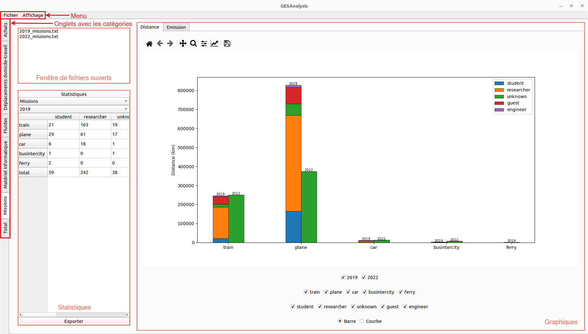
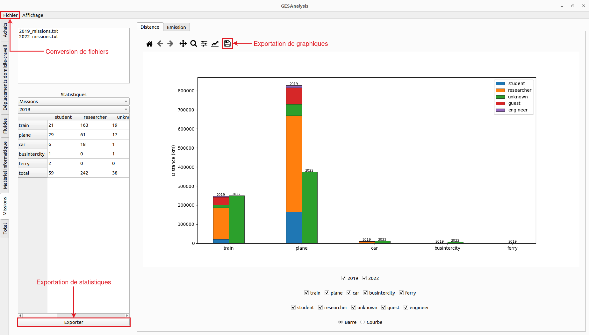

# GESAnalysis
GESAnalysis est un outil permettant d'analyser des données issues des bilans de gaz à effet de serre (BGES) en produisant des graphiques et des statistiques. GESAnalysis est un outil complémentaire à GES1point5, qui estime l'empreinte carbone des laboratoires. Cependant, une partie des informations ne sont pas utilisées par GES1point5. Pour cela, GESAnalysis va utiliser ces informations pour compléter les résultats des GES1point5 et l'analyse des chercheurs.

## Table of Contents
1. [Prérequis](#prérequis)
2. [Installation](#installation)
3. [Fonctionnalités](#fonctionnalités)

## Prérequis
Avant de pouvoir utiliser l'application sur votre poste, vous devez d'abord installer au minimum :
* [python3](https://www.python.org/downloads/)
* pip (voir [Documentation](https://packaging.python.org/en/latest/tutorials/installing-packages/))

Si vous le souhaitez, vous pouvez installer et utiliser un environnement virtuel tel que :
* venv (voir [Documentation](https://packaging.python.org/en/latest/guides/installing-using-pip-and-virtual-environments/))
* conda (voir [Documentation](https://docs.conda.io/projects/conda/en/latest/user-guide/install/index.html))

## Installation
Une fois que vous avez les prérequis, vous allez devoir installer les paquets nécessaires à l'exécution du programme. Pour cela, vous allez exécuter les instructions suivantes :

1. Ouvrir un terminal

2. Si vous utilisez venv comme environnement virtuel, vous devez activer cet environnement :
    * Sous Unix/MacOS : `source env/bin/activate`
    * Sous Windows : `.\env\Scripts\activate`

3. Installer les paquets avec pip :
    * pip : `pip install -r requirements.txt`

4. Setup python path
    * Sous Unix/MacOS : `export PYTHONPATH=$(pwd)`
    * Sous Windows : `set PYTHONPATH=%cd%`

NB : Lorsque vous ouvrez un nouveau terminal, si vous voulez lancer le programme, vous devez setup python path

## Fonctionnalités

L'interface s'organise de la façon suivante :
* Menu
* Onglets indiquant les catégories des BGES où chaque onglet possède :
    - Fenêtre indiquant les fichiers ouverts de la catégorie actuelle
    - Tableau de statistiques avec des boutons pour afficher plusieurs données dans le tableau
    - Onglets avec les graphiques avec des boutons pour personnaliser les graphiques  

### Lecture de données

L'application lit les données des BGES depuis les fichiers du type CSV, TSV, TXT et EXCEL (xlsx).  
Tout autre type de fichier ne sera pas lu.

#### Ouverture de fichier

L'ouverture de fichier se fait par le menu "**Fichier > Ouvrir**". Une fenêtre s'ouvre pour que vous renseignez le chemin du fichier, l'année et la catégorie du BGES.  
Après la lecture, l'interface met à jour les graphiques et les statistiques selon les fichiers ouverts et la catégorie.  

https://github.com/Pierre-Mar/GESAnalysis/assets/94572991/b78fdc75-b1e9-4b1c-aff9-1b72cffb5a09

#### Fermeture de fichier

La fermeture de fichier se fait en commençant par sélectionner les fichiers de la catégorie actuelle. Puis par :
* Le menu "**Fichier > Fermer**"
* Le menu contextuelle en faisant un clic droit sur les fichiers puis "**Fermer**"
Les fichiers, qui ont été selectionné, seront fermés et l'interface sera mise à jour.  

https://github.com/Pierre-Mar/GESAnalysis/assets/94572991/67a35c21-f11a-43d9-863e-1480b858dc8c

### Exportation des données

l'exportation des données fonctionne avec :
* La conversion de fichiers (csv, tsv, txt, xlsx) -> (csv, tsv, txt)
* Les statistiques exportées vers un fichier (csv, tsv, txt)
* Les graphiques exportés vers une image  

### Erreurs

2 types d'erreurs peuvent être rencontrés lors de l'utilisation de GESAnalysis.  
Le 1er est lors de la lecture ou l'exportation de fichiers. Lorsque celle-ci ce produit, une fenêtre s'ouvre et indique l'erreur rencontrée.  

https://github.com/Pierre-Mar/GESAnalysis/assets/94572991/8427129c-4c49-4785-a0a1-f3c11661eff6

Le 2e est lors de la réalisation des graphiques et des statistiques. Lorsque l'application ne trouve pas une colonne d'un fichier, une icône apparaît à coté de ce fichier et indique les avertissements lorsque le curseur de la souris passe sur le fichier.  

https://github.com/Pierre-Mar/GESAnalysis/assets/94572991/ed33bd4e-7204-44b1-a890-4682e1678c58
